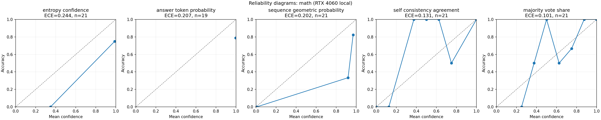

# Teacher Reliability and Mini Distillation

## Project scope

This project is a local RTX 4060 mini study, recorded in
[`docs/session-report-2026-10-02.md`](docs/session-report-2026-10-02.md): one
111-question teacher run followed by a controlled four-condition student
comparison on 640 held-out questions. The code supports only the `mini_12h`
teacher profile and a nine-row `smoke` pipeline check.

The teacher run preserves the full per-question protocol on a deterministic
subset: Qwen2.5-Math-7B-Instruct at its pinned revision, NF4 double
quantization with FP16 compute, one greedy answer, eight seeded samples, and a
1,024-token output limit. It contains 40 GSM8K, 21 MATH (three per each of
seven subjects), and 50 GSM-Plus questions. The run completed 111/111 rows on
the RTX 4060 with zero failed or pending rows. No A100 rows were imported.

The distillation follow-up trains a Qwen2.5-0.5B LoRA student on those teacher
outputs and compares `base`, `kd_all`, `kd_gated`, and `kd_oracle` on the same
640 held-out questions. The evaluation uses 300 GSM8K, 140 MATH, and 200
GSM-Plus questions. The `kd_gated` condition uses only teacher self-consistency
and does not use gold labels; `kd_oracle` is a gold-label reference condition.

## Sample experiment: the 111-question teacher run

The committed run `mini12h-rtx4060-20261001-230236` is a complete worked
example. Every question, with the teacher's greedy answer, eight sampled
answers, and confidence scores, is in
[`results/mini12h-rtx4060-20261001/SAMPLE.md`](results/mini12h-rtx4060-20261001/SAMPLE.md)
(readable table and worked examples),
[`sample_rows.csv`](results/mini12h-rtx4060-20261001/sample_rows.csv), and
[`sample_rows.jsonl`](results/mini12h-rtx4060-20261001/sample_rows.jsonl)
(adds the full greedy solutions).

| Dataset | Questions | Greedy correct | Majority-vote correct | Best AUROC (signal) | Mean agreement: correct / wrong |
| --- | ---: | ---: | ---: | --- | ---: |
| GSM8K | 40 | 85.0% | 90.0% | 0.895 (self-consistency) | 0.97 / 0.54 |
| MATH (3 per subject) | 21 | 71.4% | 81.0% | 0.950 (self-consistency) | 0.85 / 0.17 |
| GSM-Plus | 50 (48 scorable) | 81.2% | 83.3% | 0.858 (sequence probability) | 0.97 / 0.60 |

Agreement is the share of the eight samples whose answer matches the greedy
answer; wrong greedy answers have much lower agreement. AUROC measures how
well a confidence signal separates correct from wrong answers (1.0 is
perfect). With 21–50 questions per dataset these numbers are indicative only.



Regenerate the sample files from a run directory with
`python scripts/export_sample_rows.py --run-dir <run> --out-dir <folder>`.

## Distillation results

| Condition | Overall accuracy | 95% paired-bootstrap interval vs. base |
| --- | ---: | ---: |
| Base student | 25.5% | — |
| `kd_all` | 37.8% | +8.3 to +16.3 points |
| `kd_gated` | 38.8% | +9.4 to +17.2 points |
| `kd_oracle` | 37.0% | — |

The `kd_gated` minus `kd_all` difference is +0.9 points with a 95% interval of
−2.0 to +4.1 points. The mini run therefore does not establish that the
self-consistency gate improves distillation over using all teacher responses.
The teacher calibration report is exploratory and does not recommend a
production KD gate.

Committed summaries and outputs are in
[`results/mini12h-rtx4060-20261001/`](results/mini12h-rtx4060-20261001/) and
[`results/mini-distill-20261002/`](results/mini-distill-20261002/). The raw
teacher run archive and its restore verification are recorded in the session
report; model weights and caches are not stored in Git.

## Reproduce

Use the Windows RTX 4060 instructions in the
[mini runbook](docs/runbook.md). The teacher run command explicitly selects
`--profile mini_12h`; the distillation script validates that its input is a
complete, matching 111-row run before training. Model and dataset revisions,
sampling seeds, inference configuration, and known limits are described in
the [experiment design](docs/experiment-design.md) and
[data contracts](docs/data-contracts.md).

```powershell
.\scripts\setup_windows.ps1
.\.venv\Scripts\Activate.ps1
python -m unittest discover -s tests -p "test_*.py" -v
```

The initial teacher outputs were written outside the repository under
`%LOCALAPPDATA%\TeacherReliability\runs`; the backup SHA-256 and restore check
are in the session report. The committed evaluation JSONL files and reports
remain available under `results/`.

## Project docs

- [Project roadmap](docs/project-roadmap.md): current goal and completion
  status.
- [Mini study plan](docs/local-rtx4060-project-plan.md): scope, protocol, and
  acceptance criteria.
- [Remaining task checklist](docs/remaining-tasks-to-complete-study.md):
  closeout steps for the mini scope.
- [Runbook](docs/runbook.md): setup, run, resume, report, and distillation
  commands.
- [Session report](docs/session-report-2026-10-02.md): measurements,
  artifacts, and provenance.
- [Original Apply 1 brief](docs/apply-1-teacher-reliability.md): preserved as
  task provenance.
